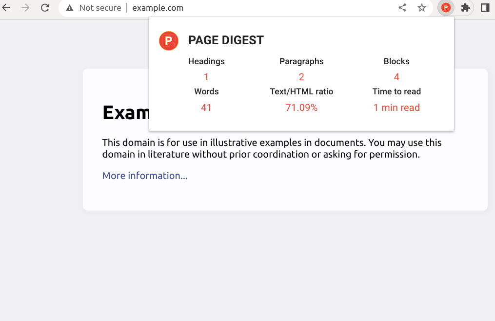

# PageDigest

> Get a quick summary of any web page with PageDigest: word count, characters, read time, text to HTML ratio. 
> Chrome Extension Written in React and Material UI.

## How to build
- `npm i && npm run build`
- include it by going to chrome://extensions
- enable developer mode
- load unpacked from `dist` directory.

## Motivation
I wanted to try out creating my first Chrome extension and needed a simple SEO utility.
Turns out there are not many utilities out there that count text to html ratio. 
I calculate text to html ratio as `textContent/bodyInnerHtml`. 
I don't think text content should include a `style` or a `script` tag.
There may be some differences in metrics compared to other apps,
due to different content scopes and formulas.

## Suggestions
Please send me your suggestions and report issues. This can turn out to be a more complex app,
but I'd like to keep the UI feel as clean as possible.

## License
[MIT](./LICENSE-MIT) © [Eisberg Labs](http://www.eisberg-labs.com)
